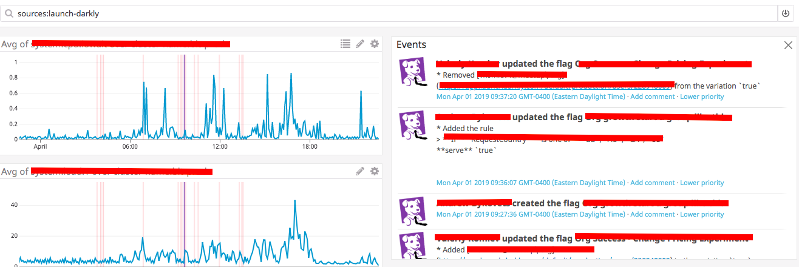

# Launch Dogly [](https://travis-ci.com/meetup/launch-dogly) [](https://coveralls.io/github/meetup/launch-dogly)

> 🚀 🌑 🐶 A Launch Darkly webhook handler that records changes as datadog events



## 🤔 about

Your observability and monitoring strategy should include visibilty into notable
events in your system in order to understand system triggers. In a continuously deployed
system, production testing often happens at runtime via feature flag toggles.

This lambda is triggered on updates to Launch Darkly feature flags and records them
as events in Data Dog which makes them available to overlay your system and application metrics.

## 👩‍🏭 development

This is a [rustlang](https://www.rust-lang.org/en-US/) application.
Go grab yourself a copy of [rustup](https://rustup.rs/).

## 🚀 deployment

This is a rust application deployed using ⚡ [serverless](https://serverless.com/) ⚡.

You'll need the following

* A [Datadog API key](https://app.datadoghq.com/account/settings#api)

* A configured [Launch Darkly Webhook](https://app.launchdarkly.com/pro/integrations/webhooks/new)

Enable web hook secret signing to verify requests come from Launch Darkly.

To reduce the the number of events you recieve you can be selective of
which resources an actions trigger your webhook. Below is a policy that
restrictions actions to flags and a subset of target actions.

```json
[
  {
    "resources": [
      "proj/*:env/*:flag/*"
    ],
    "actions": [
      "createFlag",
      "updateOn",
      "updateRules",
      "updateTargets",
      "updateOffVariation",
      "updateFlagVariations",
      "deleteFlag",
      "updateName"
    ],
    "effect": "allow"
  }
]
```

Deployments expect an `DD_API_KEY` and `LD_SECRET` environment variable.

## 🤸 Usage

In Datadog's event stream you can search for `sources:launch-darkly`. The following metric tags
are extracted from LaunchDarkly events

| Tag       | Description                                                                      |
|-----------|----------------------------------------------------------------------------------|
| `kind`    | The kind of target entity Launch Darkly was triggered for, currently only "flag" |
| `name`    | The name of the flag                                                             |
| `action`  | Action that triggered the change                                                 |